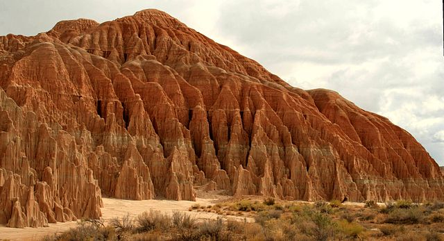
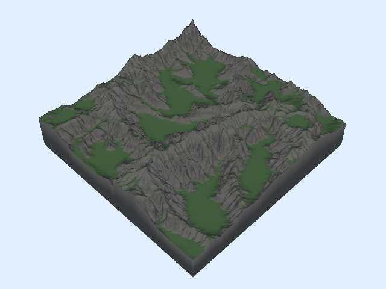
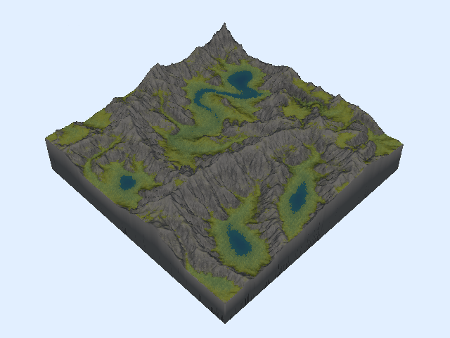
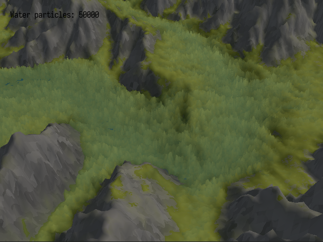
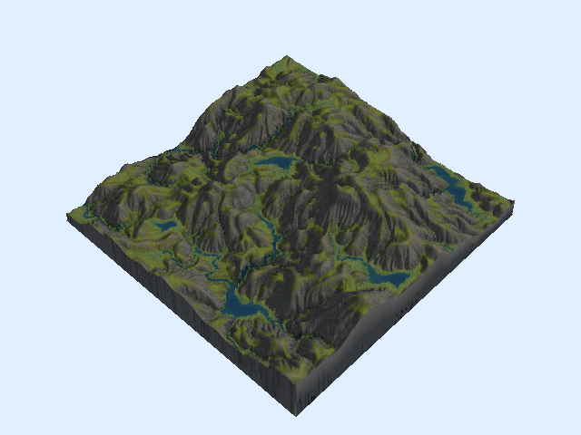
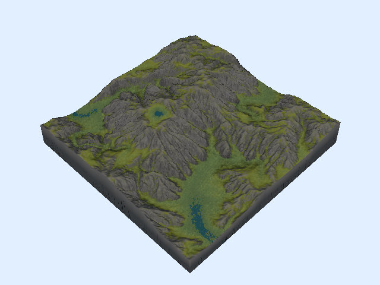
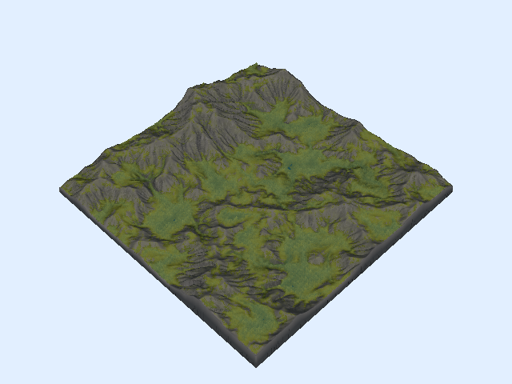
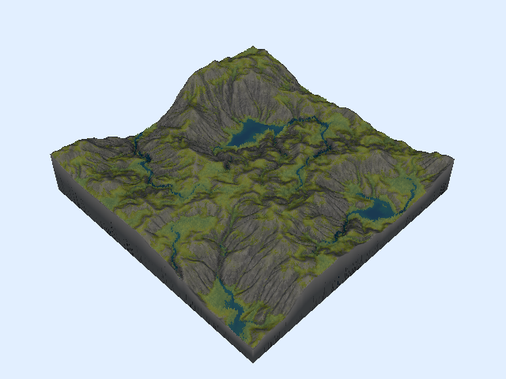
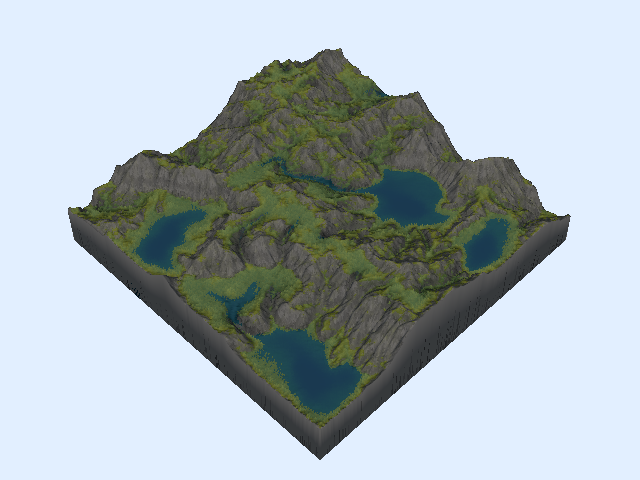

This is a neat little technique for procedural terrain that I had seen a few
other people show off online.  I always though it looked really cool so I
decided to implement a version of it myself.

In nature, when there is a bunch of water that comes into contact with a 
surface over time, it will gradually carve out interesting looking erosion 
patterns.  This is because the water picks up microscopic pieces of the rock or
soil and then moves them somewhere else.  This is called *hydraulic erosion*.



We can imitate this process on virtual terrain by simulating water that modifies
the terrain's height as it moves, kind of resembling how sediment shifts around
on real terrain.

I was also looking for an excuse to try out [Zig](https://ziglang.org/), so that
is what I will be using to implement the project.  Don't worry if you're not 
familiar with Zig, all of the code snippets should still be readable, and I've
quarantined my thoughts about the language to a short section at the end.

A lot of the code in this write-up has been simplified to be as readable as 
possible, but if you actually want to read through the source, it's available
on my GitHub [here](https://github.com/jehoz/TerrainGen).

# Before we start

It won't be very exciting if we just try to erode a flat plane, so we'll need
to start off with some initial topography.
If you've ever played around with procedural generation, you probably
know that it's very easy to get some serviceable looking terrain just by using
some kind of 2D noise as a heightmap, and we'll be doing exactly that.
I am using ridged simplex noise for the in most of the demo images/videos below,
but the type of noise isn't that important, we just need some basic peaks and 
valleys to work with.

The heightmap is rendered to a texture and send to the GPU. Then we have a 
vertex shader that deforms a flat mesh according to the values in the heightmap, 
which gives us something that looks like this:


## A slightly better data structure

Any heightmap we generate is necessarily going to be a discrete 2D array of 
values.

This is usually fine because you just want a heightmap to displace the
z-coordinates of mesh's vertices, and because the mesh is a mesh, the edges will
smoothly interpolate between the values in the heightmap, giving the final
result the appearance of being continuous.

But in our case we actually want our heightmap to be continuous (or at least act
like it) while we're working with it on the CPU.  We need to compute the motion
of water sliding down the hills of our terrain, and this is going to be a lot 
easier if we can sample the height and slope of any non-discrete point on our 
surface.

So instead of directly dealing with the array of height values, I wrapped it in
an abstraction that does some bilinear interpolation under the hood, which
should make our lives a little easier.

```zig
const ScalarField = struct {
	// leaving out most of the implementation for brevity

	/// Get the value of a given point on the field
	/// (bilinearly interpolated from the four surrounding cells)
	pub fn get(self: ScalarField, pos: Vector2) f32 {
		...
	}

	/// Get the slope/gradient of a given point on the field
	pub fn gradient(self: ScalarField, pos: Vector2) Vector2 {
		...
	}

	/// Modify the value of a given point on the field
	/// (delta is distributed across the four surrounding cells)
	pub fn modify(self: ScalarField, pos: Vector2, delta: f32) void {
		...
	}
};
```

# Simulating water

We'll be going with the typical "particle-based" approach here (although there 
are some [neat alternatives](https://xing-mei.github.io/files/erosion.pdf) that 
are also worth reading into).

The idea is that you randomly spawn a bunch of water droplets (or "particles") 
all over and have them individually erode bits of the terrain.  Each one moves 
only a small amount of sediment, but in large quantities, they carve out 
patterns that are reminiscent of real life hydraulic erosion.

## The life of a water droplet

In the code, a droplet of water looks like this:

```zig
const WaterDroplet = struct {
    position: Vector2,
    velocity: Vector2 = .{ .x = 0, .y = 0 },
    volume: f32 = 1,
    sediment: f32 = 0,

    pub fn init(pos: Vector2) WaterDroplet {
        return .{ .position = pos };
    }
};
```

And this is what it does throughout the course of its life:

```zig
var drop = WaterDroplet.init(.{
	.x = random.float(f32) * width,
	.y = random.float(f32) * height,
});

while (drop.volume > opts.min_volume) {
	// Movement
	...

	// Sediment transfer
	...

	drop.volume *= 1 - opts.droplet_evaporation;
}
```

A droplet is spawned somewhere on the surface of our terrain.  It moves, transfers some sediment and shrinks down a little bit.
Once its volume gets too small, we throw the it in the trash and move on to the next one.

`opts` refers to an `ErosionOptions` struct that gets passed into our erode function.
It holds all of the "tweakable knobs" for our simulation.
You can see here that two of those knobs control how small the droplet is allowed to get before we drop it (`min_volume`), and how much the volume decreases every step (`droplet_evaporation`).  
Now let's look at what actually happens inside that loop.

## Movement

First thing we do every step is compute the particle's movement with some extremely bastardized kinematics. 

```zig
const grav_force = self.elevation.gradient(drop.position).scale(opts.gravity);
drop.velocity = drop.velocity.scale(1 - opts.friction).subtract(grav_force);
drop.position = drop.position.add(drop.velocity.normalize());
```

As you can see, we're not trying to be very scientifically accurate.
We also have two more knobs.  `gravity` and `friction` are parameters that affect how much the slope impacts the velocity, and how much velocity degrades over time, respectively.
We always move the droplet one unit in whatever direction so that we're not stuck in the same place for too long nor are we skipping over intermediate cells if our droplet starts moving too fast.

You can get fancy with this part and implement a more accurate rigid-body 
physics simulation, but I found that doing it this way works perfectly fine.

## Sediment transfer

Before we get into the exact implementation of this step, let's look at what it's doing.

```zig
const delta_sed = // pretend this is calculated somehow

drop.sediment -= delta_sed;
self.elevation.modify(init_pos, delta_sed);
```

This should be pretty easy to understand.  We calculate the amount of sediment to move (negative for erosion, positive for deposition) and then transfer it from the terrain to the droplet or vice versa.  There is no hard and fast rule for how you have to compute `delta_sed` (everyone seems to do it a little differently), but it's important to get it right or the simulation will spiral out of control.

Initially I calculated a "maximum sediment capacity" for the water droplet, and then computed `delta_sed` as the difference between the droplet's held sediment and this capacity.

```zig
const delta_elev = self.elevation.get(drop.position) - self.elevation.get(init_pos);
var max_sed = drop.velocity.length() * drop.volume * delta_elev * opts.sed_capacity;
max_sed = @max(0, max_sed);

const delta_sed = (max_sed - drop.sediment) * opts.sediment_transfer_rate;
```

This technique works pretty well, but you will occasionally get big spikes or deep pits that form because `delta_sed` becomes too extreme.
I found the best way to address this is to constrain `delta_sed` so that it never erodes or deposits more than the droplet's change in elevation.

```zig
const delta_sed =
	smaller(delta_elev, max_sed - drop.sediment) * opts.sediment_transfer_rate;
```

(using this helper function that just returns whichever argument is closer to zero)
```zig
fn smaller(x: anytype, y: anytype) @TypeOf(x, y) {
    if (@fabs(x) < @fabs(y)) {
        return x;
    } else {
        return y;
    }
}
```

At this point the erosion was working like a charm, but after doing some experimenting, I figured out that this whole part can be simplified without any distinguishable difference in the output.
I measured a few runs (each with different parameters) and in each one, `delta_elev` ended up being smaller than `max_sed - drop.sediment` over 99% of the time!

So instead we can scrap the maximum sediment and just set `delta_sed` to the change in elevation (multiplied by a small "transfer rate" coefficient).  And when we do that we no longer need to track how much sediment the droplet is carrying.  Here is what our code looks like now:

```zig
const delta_elev = self.elevation.get(drop.position) - self.elevation.get(init_pos);
var delta_sed = delta_elev * opts.sediment_transfer_rate;

self.elevation.modify(init_pos, delta_sed);
```

We've diverted a bit from the realism of the simulation, but I personally don't care about that very much as long as the results still look good.

### One last touch

We can also adjust the the amount of sediment that is deposited versus the amount that is eroded if we want to control how much the terrain "fills up".

```zig
if (delta_sed > 0) delta_sed *= opts.sediment_ratio;
self.elevation.modify(init_pos, delta_sed);
```

This part isn't super necessary, but it grants us an extra dimension of creative control, which is always good in my opinion.

## Rendering

Finally here is a demo of everything in action:

<video controls>
    <source src="res/02.webm" type="video/webm; codecs=vp9;vorbis">
</video>

I don't know about you but I think this already looks pretty cool.
You should immediately be able to pick out some characteristic features of this technique: grooves forming along the slopes (these are called rills or gullies) and valleys filling up into flat planes.

A common trick you will see done with terrain is to render it with a shader that colors/textures the mesh differently according to how "flat" it is at each point — more horizontal parts are rendered as grass and more vertical parts are rendered as rock or dirt.



This looks nice, but I think it would look better if we added some variety to the flat green color.

# Moisture

This is an approach I didn't see in the other hydraulic erosion sims I peeked at (although surely someone has done it before).  Naturally water doesn't just move sediment around, it also makes it *wet*, and parts of the ground that see more waterflow are typically more wet than other parts.

We'll create another `ScalarField` to keep track of the moisture level throughout our terrain and then add the following code to our loop:

```zig
const inv_speed = @max(0, 1 - drop.velocity.length());
const inv_saturation = @max(0, 1 - self.moisture.get(drop.position));
const delta_moisture = inv_speed * inv_saturation * opts.soil_absorption;

self.moisture.modify(drop.position, delta_moisture);
```

We want the added moisture to roughly correspond to the "amount of time" a droplet spends at each point along its path.  Obviously we haven't been using fixed time steps (see the movement section above), so we use an "inverse speed" value here instead.  We also want the added moisture to scale inversely with how wet the terrain already is (this keeps the moisture levels from getting too splotchy and out of control).

After our droplet dies, we'll go though the entire terrain and "evaporate" a little bit of the moisture from the soil.

```zig
for (self.moisture.data, 0..) |_, i| {
	self.moisture.data[i] *= 1 - opts.soil_evaporation;
}
```

Being able to tune the `soil_absorption` and `soil_evaporation` parameters is important for finding a good balanced level of moisture for a particular terrain.

## Rendering

Now we can use the terrain's "moisture map" to add some visual interest to our landscape.

Wet soil tends to foster more plant life than dry soil (although this is a gross oversimplification) and when there is *a lot* of water in a particular spot, you might even expect rivers and lakes to form.
In our fragment shader, instead of shading the ground a flat green, we can adjust the color based on the moisture level.  If you wanted more accurate formation of bodies of rivers and lakes you could implement some kind of fluid dynamics, but instead we're going to cheat (kind of) and pretend that any part of the ground above a certain moisture threshold "is" water and we'll color it blue.

I'm also coloring the wet parts of the rock slightly darker so that the grooves have a bit more contrast.

<video controls>
    <source src="res/04.webm" type="video/webm">
</video>

In my opinion, this looks *way* better than flat green ground in the image above.

I even got a little crazy at the end and added some <s>trees</s> ambiguous foliage to the wet parts of the terrain with the magic of shell texturing (although it's a little hard to see unless you zoom in a bit).




I'm omitting all of my shader code from this write-up but feel free to check out the source if you're interested in how it all works.


# Gallery

Here are a few different examples I generated to show off the variety you can get by just tweaking parameters and the initial heightmap.









# Appendix: Thoughts on Zig

Like I mentioned, part of why I started this entire thing was to play around with Zig.  I've been casually keeping my eye on the language since around the time it popped up, but this is the first time I've ever used it.

From what I can tell, Zig is trying to do something unique by specifically competing with C, *not* C++.  To this end, Zig is a rather minimalist language (kind of like Go) but one that seems to respect your competency as a computer programmer (unlike Go).  It feels a lot like writing C, but without several of the reoccurring headaches you get from writing in C.
The downside, though, is that in its current state it adds plenty of its own headaches that kind of ruin the experience.

I have nitpicks with some of the language design choices, but these are easy to cope with.
The real problem is that Zig is still so young (version 0.11.0 as of writing this) and there is a severe lack of good documentation.  Significant parts of the language, standard library, and build system are still in flux, with new versions often breaking backwards compatibility.  A handful of times I found an example of code that did what I wanted, but wouldn't compile.  Then I had to dig around and find the relevant discussion on a GitHub issue that explained why that API changed and what it was changed to.

That all being said, I actually like Zig and its design philosophy for the most part.  It's just currently in a state where using it to any serious capacity means you have to stay up to date with the bleeding edge of the language's development.

I imagine most of the sharp edges will get smoothed out come 1.0, and I'm very excited to see what the language looks like at that point.  But until then, I will probably just watch from afar.
