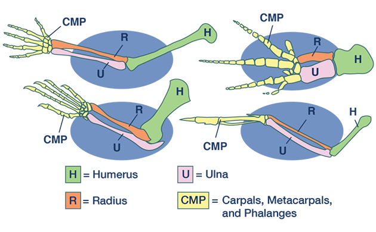
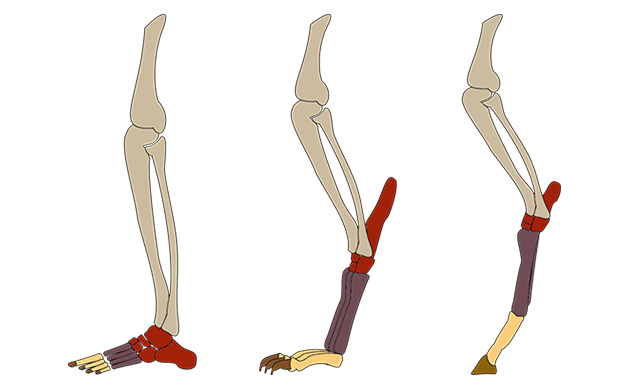
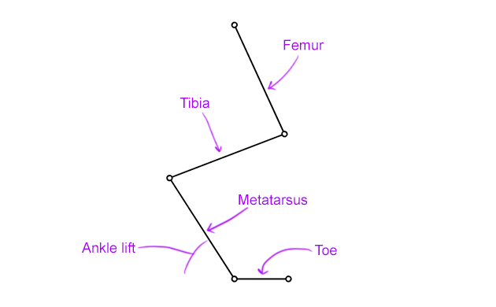
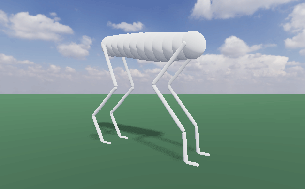

This is in service of a larger project that may or may not pan out, but for now
I'm tinkering around with a kind of "creature generator".  This write-up is
(hopefully) the first of several to come where I model and implement some part
of a creature. Today we're getting into legs and the way they move. 

# What is a leg even really?

Long ago the only things that had bones were fish.  And then some of those fish
got nuts and decided to get out of the water.  One thing led to another and now
all sorts of bony leg-havers dominate the earth, and we call these things
*tetrapods*.  There are also *arthropods* which have a different kind of
bone-less leg, but we're going to ignore them for now.

Tetrapods are cool because if you compare the limb bones across different
species, you will find that they are structurally very similar because they all
descend from the same nubby proto-legs that those ancient fish developed.

Limbs can do all sorts of crazy things, but today we're just concerned with
walking, so we're going to be specifically modelling some tetrapod *legs*.
These legs generally fall into three categories:

1. *plantigrade* legs, where the metatarsals lie flat along the ground (e.g. human legs)
2. *digitigrade* legs, where toes rest on the ground but the ankle is lifted up (e.g. cat legs)
3. *unguligrade* legs, where the whole "foot" is lifted up almost vertically and the animal walks on what are effectively its toenails (e.g. horse legs)

Naturally, since these three types of leg are made of the same parts and sort
of blend into one another, I wanted to flesh out one parametric "leg" with a
continuous state-space that encompassed all three.

To accomplish this, our creature's legs will have four bones/segments: femur,
tibia, metatarsus, and toe (for simplicity I'm going to use these names for
both front and back legs).  The parameters for a leg will include the lengths
of these segments, as well as an "ankle lift" factor which determines the angle
between the metatarsus and the ground when standing.  Toes will always lie flat
on the ground, and we can cheat a bit to get unguligrade legs by just reducing
the toe length to zero.

Let's think about how we actually want to implement these legs.

# Implementing legs

Normally, a 3D character model in a game or animation software is accompanied
by a bunch of bones that let you contort the mesh.

In practice, there are some bones (like the ones making up an arm or leg) that
you, as the animator, don't always want to move one-by-one.  It's often more
convenient to just put the hand or foot wherever you want it to be, and then
have the rest of the arm or leg figure out how it needs to bend to make that
work.  This process where a limb "figures out" how to pose itself is called
*inverse kinematics* (IK).

It turns out that to make something walk or run, we also only really care about
how its *feet* move, and so our legs will be completely driven by inverse
kinematics.  Let's start with a simple example.

## A quick primer on IK

The simplest practical example for understanding IK is a 2-link kinematic chain
(e.g. a leg with one bone between the hip and knee, and another between the
knee and foot). If we know the position of the hip and the position of the
foot, we can use some trigonometry and analytically determine the angle and
position of the knee.

I was going to make a little demo of this on Desmos but I found one that
someone else made and it's a lot nicer than what I probably would've done. So
shout-out to whoever made this: <https://www.desmos.com/calculator/zds5lmt401>

Here's the gist: the hip, foot, and knee form an imaginary triangle, and it
turns out that we know all three side lengths of this triangle.  So using the
law of cosines and some other trig you probably learned in high school, we can
find the internal angles of the triangle and its rotation in space, and from
there we can find the position of the knee joint.

This is obviously very cool and exciting, but our creatures' legs will have
more than two segments. You might think we can sneak in an extra link or two
and keep solving everything analytically. Well guess what, we can't!  At least
not without getting creative.  It turns out that when you add more degrees of
freedom, the system becomes *redundant* and *underconstrained* meaning there
are infinitely many solutions and our analytical approach no longer works.  I
don't want to get into this too deeply here, but there are other [good
resources](https://motion.cs.illinois.edu/RoboticSystems/InverseKinematics.html)
you can check out if you want to really get into the math behind IK.

Of course there are ways to solve these types of redundant systems.  General
purpose IK solvers usually employ some kind of numerical method that figures
out the chain's pose using gradient descent or Netwon's method.  These work
pretty well, and we will need to go this route eventually if we end up
implementing body parts like necks and tails, but numerical methods tend to be
more computationally expensive and offer less precise control.  It would be
better to stay in the nice clean world of analytical solutions for as long as
possible. And fortunately for us, that is still an option.  All we have to do
is get a little creative.

## Getting a little creative

The key to getting back to an analytical solution is eliminating the redundancy
of our kinematic chain, meaning the "extra" joints are fixed or determined some
other way.  Then we can run IK on the rest of the leg, which is no longer
underconstrained. There's no one "correct" way to do this, so we're kind of
just winging it and getting the leg's movements to look good.

First of all, I think we can safely ignore the toe bone in our actual kinematic
chain.  It makes more sense for our "end effector" to be the joint between the
metatarsus and the toe because that's what we want making contact with the
ground.  The toe kind of just sticks out from there and it will move with the
rest of the foot (we can always animate it later). So our actual kinematic
chain is three links: femur, tibia, and metatarsus.

Since we decided that our "ankle lift" parameter would determine the angle
between the metatarsus and the ground, we can start by fixing the orientation
of the metatarsal bone. All we have to do is take the ankle lift and use some
trig to find the x and y coordinate offset of the ankle joint from the foot
target. And once we know our ankle position, we've reduced the IK problem back
down to two links, meaning it's solvable!

<video autoplay loop muted>
    <source src="res/desmos_leg_1.webm" type="video/webm; codecs=vp9;vorbis">
</video>

Obviously this isn't looking great.  The metatarsus is not rotating at all no
matter how the rest of the leg moves. Let's at least have it inherit the
rotation of the entire leg.  We'll find the angle between the y-axis and the
straight line from the hip to the foot.  Then we can add this angle to the
ankle lift before positioning the ankle joint.  We'll also use this angle to
rotate the toe.

<video autoplay loop muted>
    <source src="res/desmos_leg_2.webm" type="video/webm; codecs=vp9;vorbis">
</video>

Now we're cooking.  I also want the ankle to bend in and out as the leg flexes
and extends.  To do this, I'm going to add another parameter to our leg that
I'm calling the "natural bend".  We can figure out the maximum length of the
leg at full extension, and the natural bend says what percentage of this is the
leg's neutral resting length.  Then, if the distance from the hip to the foot
is shorter or longer than this, the effective ankle lift decreases or increases
accordingly.  

<video autoplay loop muted>
    <source src="res/desmos_leg_3.webm" type="video/webm; codecs=vp9;vorbis">
</video>

This one is a little more subtle, but it particularly helps when the leg
extends towards its maximum length.  There are still some edge cases where this
looks kind of wonky, and you could certainly come up with some clever ways to
make it look even better, but I'm happy enough with it to leave it as is.

[Here's the fully functional leg on Desmos](https://www.desmos.com/calculator/vs8uhtdrfw).

I implemented this in Godot and put a dummy creature together with four of
these legs.  The front legs work the same way as the back, but the knee joint
bends in the opposite direction.  Also I made the toes lie flat whenever the
foot was touching the ground, so that they look a little more realistic.

Now let's put those legs to use.
# Gait

A leg's main function is locomotion, and the particular way an animal moves
it's legs as it locomotes is called a *gait*. Animals use different kinds gaits
for all sorts of reasons, but movement speed tends to be the main one (a dog's
feet move very differently between a walk and a run).

Each gait is a cyclical pattern within which each leg completes a full step — a
step being composed of an airborne "swing" phase and a grounded "stance" phase.

The two most distinguishing factors of a gait are:
1. The phase differences between each foot
2. The relative duration of the swing and stance portions of the step (sometimes called the duty factor).

We'll be controlling the movement of our dummy's feet using oscillators that
effectively break down into two periodic waves: one driving the front-back
motion of the foot and the other (offset by a  \\(\frac{\pi}{2}\\) phase shift)
driving the up-down motion.  For now these will just be plain sine waves.
Let's take a look.

<video autoplay loop muted>
    <source src="res/creature_walk_1.webm" type="video/webm; codecs=vp9;vorbis">
</video>

Wow, look at him go!  This is obviously not a very realistic gait — all of the
legs are synchronized with each other.  Let's fix that.

## Leg phase differences

This part is pretty straight forward.  All we have to do is give some of the
foot oscillators a phase shift so that they don't all step at the same time.
We could set each one individually, but I prefer to generate the four offsets
from a combination of two variables that we control: one phase offset between
the front and back legs and another between the left and right legs.  These are
additive so the difference between the front-left leg and rear-right leg is the
sum of these two values.

Let's start by setting a phase offset of \\(\pi\\) between the left and right
foot oscillators.

<video autoplay loop muted>
    <source src="res/creature_walk_2.webm" type="video/webm; codecs=vp9;vorbis">
</video>

Now we're getting somewhere!  This is a type of gait called a *pace* (although
a pace is usually faster than this).  Let's add some offset between the front
and back legs now.  Something around \\(\frac{\pi}{2}\\) should give us
something that resembles a normal walk.

<video autoplay loop muted>
    <source src="res/creature_walk_3.webm" type="video/webm; codecs=vp9;vorbis">
</video>

This is already starting to look pretty good in my opinion.  We can get all
sorts of very different looking gaits if we just mess around with these two
phase offset values.

## Swing-stance ratio

A step cycle is always split into a part where the foot is planted on the
ground (the *stance* phase), and a part where the foot is in the air (the
*swing* phase). So far in our creature's gaits, these have been equal in
proportions. But in real life, faster gaits have shorter stance phases and
longer swing phases, and slower gaits have the inverse.  If we want to our gait
animations to look more convincing, we can't just speed up or slow down the
whole animation: we need a way to manipulate our oscillators' swing-stance
ratio.

Let's first consider the sine wave driving the up-down motion of the foot.
Clearly, if we want to bias towards a longer swing phase we will need to squash
the part of this wave that is below zero and proportionally stretch out the
part above zero (and vice versa for biasing in the other direction). There are
probably a few good ways to accomplish this, but after fiddling around in
Desmos for a while I came up with this mess of a function to replace our plain
sine wave:

$$
f\left(x,k\right)=2\frac{k^{\sin\left(x\right)}-\frac{1}{k}}{\left(k-\frac{1}{k}\right)}-1
$$

\\(x\\) is the time input like before, and \\(k\\) is the "skew factor" whose
range is \\((0, \infty)\\)

<video autoplay loop muted>
    <source src="res/wave_1.webm" type="video/webm; codecs=vp9;vorbis">
</video>

When \\(k\\) is very small, the wave becomes dominated by the positive part,
and when \\(k\\) is very large, it becomes dominated by the negative part.  You
can play around with this yourself [here](https://www.desmos.com/calculator/8qtsamxsrh).

At \\(k=1\\) this function is actually undefined, but the wave function starts
to become a normal sine wave as \\(k\\) approaches \\(1\\) from either side, so
we can just handle that as an edge case in our implementation.

So now our foot can spend more time on the ground or in the air, but the
front-back movement no longer syncs up with the up-down movement. The foot
oscillator's other wave function needs to be modified as well.

The foot should ideally be moving forward throughout the swing phase and backward
throughout the stance phase. If the foot is in the air for a shorter time than
it is on the ground, it will have to move forward faster than it moves
backwards, meaning we have to squeeze the rising slope of the wave, and stretch
the falling slope.

Again I fiddled around in Desmos until I came up with a function that did
roughly what I was looking for.  Here it is:

$$
f\left(x,k\right)=\frac{1}{k}\arctan\left(\frac{k\sin\left(x\right)}{1-k\cos\left(x\right)}\right)
$$

<video autoplay loop muted>
    <source src="res/wave_2.webm" type="video/webm; codecs=vp9;vorbis">
</video>

Here the skew factor \\(k\\)'s range is \\((-1, 1)\\), and effectively becomes
a sawtooth wave at the extremes.  This is also undefined at \\(k=0\\), but just
like our other function, it approaches a normal sine wave as \\(k\\) gets close
to zero, so we can handle this edge case the same way.  You can play around
with this function [here](https://www.desmos.com/calculator/lldblzmvv0).

The final piece in this puzzle is matching up the two skew factors for the
waves.  This was a little trickier than I wanted it to be.  You ideally want
the x-intercepts of one wave to perfectly line up with the stationary points of
the other wave, across all valid skew factors.  I wasn't quite able to do that,
but I got close enough to have it look good in practice.  We'll take a bias
factor \\(b\\) and use it to generate our skew factors as follows:

$$
k_{duty} = e^b
$$

$$
k_{slope} = \frac{2}{\pi}\arctan\left(b\right)
$$

<video autoplay loop muted>
    <source src="res/wave_3.webm" type="video/webm; codecs=vp9;vorbis">
</video>

\\(b\\) can be any real number, and skews both waves symmetrically for positive
and negative values. I made another Desmos graph that that overlays the two
waves [here](https://www.desmos.com/calculator/ibki8wwuvm).

Now that we figured that out, we can upgrade our foot oscillator to use these
functions instead of normal sine waves, and we can have "swing-stance bias" be
another parameter we can put in our gait-making toolbox:

We can bias towards the swing phase for fast gaits like a gallop:

<video autoplay loop muted>
    <source src="res/creature_walk_4.webm" type="video/webm; codecs=vp9;vorbis">
</video>

and we can bias towards the stance phase for slow gaits like a walk:

<video autoplay loop muted>
    <source src="res/creature_walk_5.webm" type="video/webm; codecs=vp9;vorbis">
</video>

## Final touches: body movement

At this point, the most important parts of the gait animation are done, but
it's still looking pretty stiff.  Naturally you would expect the body itself to
be a little more dynamic when the legs are moving all over the place, so let's
make that happen. This write-up is already longer than it deserves to be,
though, so I'm going to be super brief here.

As you can probably see, our creature's body is made up of a bunch of segments,
and the legs are attached to the ones at the very front and back.  Let's have
these first and last segments bob up and down throughout the walk cycle.  You
could probably do this with some kind of pseudo-physics simulation, but I just
sample the two foot oscillators with a bit of offset, and use those values to
set the height of the body segment and I think it looks pretty good. 

We can also make the body segment turn left and right very slightly depending
on which foot is forward and how far apart the left and right feet are.

Then after setting the position and orientation of these two body segments I
generate a cubic Bezier curve between them and place the rest of the body
segments along this curve.  This is a quick and dirty way to make the body look
like it has a spine that is twisting and bending as the creature moves.

<video autoplay loop muted>
    <source src="res/creature_walk_6.webm" type="video/webm; codecs=vp9;vorbis">
</video>

# Wrapping up for now

That pretty much covers everything I've done so far.  I've got more ideas that
I want to incorporate, but I'm trying to get better at finishing one thing at a
time so that I can document my progress with these write-ups.

The next thing I'd like to tinker with is combining our current gait animation
with a more "traditional" kind of procedural walk animation, where the foot
stays planted at some position while the body moves forward in space, and then
quickly steps forward when the body gets too far away.  Currently our creature
is kind of just moonwalking in place, but we obviously want him to be able to
move around in some environment.  We could slide the whole creature forward as
he's walking, but this starts to look really bad if the movement speed and
animation aren't perfectly synced up.  And what if the ground is uneven or he's
going up a flight of stairs?

Also tetrapods obviously aren't the only animals with legs.  There are all
sorts of arthropods like bugs and crabs that have different kinds of legs.  And
legs aren't even the only type of limb!  How would we implement wings, arms,
and flippers?

Anyway, you can check out the source code of the final Godot project [here](https://github.com/jehoz/legs-and-gaits).

(I'll try to get a web build of this up and running soon)

