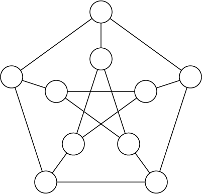
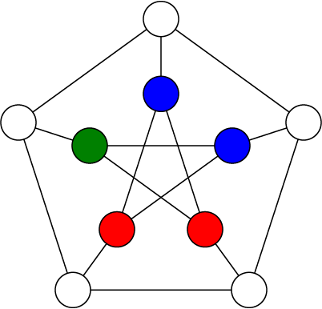
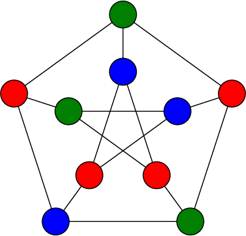

A little while ago I came across [this
video](https://www.youtube.com/watch?v=s2dknG7KryQ) of Ed Kmett talking about
something called propagators.  From there I found [the paper that originally
introduced these
things](https://dspace.mit.edu/bitstream/handle/1721.1/44215/MIT-CSAIL-TR-2009-002.pdf),
co-written by Alexey Radul and the venerable Gerald Sussman (which I would
highly recommend checking out).  Radul's [PhD dissertation from the same
year](https://dspace.mit.edu/bitstream/handle/1721.1/54635/603543210-MIT.pdf)
is effectively a more thorough and unabridged version of the paper, and also
worth reading through if you, like me, become seduced into implementing these
yourself.


# Propagator networks?

I think the best way to describe propagator networks (or *propagation* networks
— both get used interchangeably) is that they are a model for building
computations, somewhere between a design pattern and a programming paradigm.
The standard approach to computing has us build a program as a sequential
evaluation of expressions, each of which transforms our data or produces some
side effects. This obviously works pretty well, but it encourages us to
approach problem-solving as a kind of one-way mapping from a known input to an
unknown output, and we sometimes have problems that don't fit nicely into this
frame.  Instead of having one thing that transforms into another, what if we
have a bunch of things that "non-linearly" relate or react to one another?

Propagation networks are really great at expressing this latter type of
problem. Networks are made up of a bunch of "cells" which accumulate
information *about* a value (I know that's a bit abstract, but bear with me
here) and we interconnect these cells with reactive functions called
*propagators*. Propagators link some input cells to some output cells, and when
any of the inputs are updated with new information, the propagator pulls in all
of the inputs, processes that information in some way and propagates the result
to all of the outputs.

This architecture turns out to be pretty flexible and opens up a new kind of
expressive power for us. By modelling the flow of information as a graph rather
than a sequence or tree, we relax the linear structure of time in our approach
to solving a problem.  We simply implement relationships or connections
between values, and the order in which they are evaluated is determined at
runtime.

However, we now have some new pitfalls to avoid. Unless cells have a way to
determine whether incoming information is "new" or not, our network will just
keep propagating stuff around forever. And since we would probably like our
programs to terminate, we need to carefully define decide how to represent this
information, and what it means for cells to "accumulate" it.

## Time for some math

Before we come up with a concrete implementation for our "partial information",
we need to decide what kind of laws it should follow. When a cell gets some new
information, we intuitively expect the result to be a logical combination of
the information coming in and the information that was already in the cell. And
if the incoming information isn't just redundant, we want that combination to
    be "greater than" either of the inputs on their own, in the sense that it
    holds more information.

Whenever we need a way to talk about a class of things that follow some abstract 
rules, it's a safe bet that
mathematicians already have an entire field dedicated to what we're looking for.
And, lo and behold, this is the case for us here.
A set where we can compare elements using the `<=` relation is called a 
[partial order](https://en.wikipedia.org/wiki/Partially_ordered_set).
And better yet, there's a special type of partial order called a 
[semilattice](https://en.wikipedia.org/wiki/Semilattice) 
which includes an operation we can use to combine elements.

Before I start throwing more jargon around let's get a little example going.
Say we have a network where we want each cell to settle on one of three values:
`A`, `B`, or `C`. The information inside a cell in this case is simple: at any
point in time, a cell stores the set of values it *could* be. We'll initialize
the cells with the universal set `{A,B,C}` and the idea is that some of these
elements will get discarded over time until we're down to a singleton, which we
can interpret as the final value for the cell. There's a neat little thing
called a [Hasse diagram](https://en.wikipedia.org/wiki/Hasse_diagram) which
lets us visually represent partial orders.  Let's make one for the information
in our cells.


The arrows between elements in the Hasse diagram indicate the ordering between
elements. We can say that `x <= y` if there is a direct path from `x` to `y` in
the diagram (or they are the same). Note that it doesn't really make sense to
ask whether `{A, B}` or `{A, C}` is "greater" than the other, which is why our
information is a *partial order* not a *total order*! You should be able to see
how the elements contain more information (or less entropy, if that makes more
sense to you) as we move up the graph.

The semilattice operation I mentioned that let's us combine elements is 
called "join" (since we are specifically dealing with join-semilattices; there's
a dual operation called "meet" for, you guessed it, meet-semilattices).
What join actually does is gives us the "least upper bound" for two elements of 
the semilattice, which is the least element that is greater than both of the 
operands.  For example, the least upper bound of `{A,B}` and `{B,C}` in the diagram above
is `{C}` so `{A,B} ∧ {B,C} == {C}`.

You might have noticed by now that the top of the Hasse diagram has an empty
set element `{}`, which doesn't really correspond to a value.  In practice, if
our cell holds the empty set, it means there are no possible values that the
cell could be, and that our problem is unsolvable! In other words, moving above
the row of singletons means that we've encountered some kind of contradiction,
in which case we immediately stop propagating and indicate that our computation
has failed.

Ok that was a lot of explaining, but now we get to actually put all of this
into practice!

# Constraint satisfaction problems

Radul picks out a few different subdisciplines which all share a kind of
non-linear approach to computing, and thus generalize very nicely to
propagation networks, but the one I'm the most drawn to at the moment is
constraint satisfaction problems.

In a CSP, you have a bunch of variables and some rules for how those variables
relate to each other (called constraints), and the goal is to assign a value to
each variable such that all of your constraints are satisfied. This obviously
maps super nicely onto propagator networks.  We'll create a cell for each
variable, which will store information about what the variable could be (i.e. a
set of possible values).  Between these cells we install propagators which
enforce the relations by translating between sets of possibilities.  Each cell
is then able to refine its possibility-space by taking the intersection of the
incoming sets, ideally culminating in a single value.

## Vertex coloring

Let's look at a nice simple CSP and how we would solve it with a propagator
network. A sudoku puzzle is the typical example of a CSP that most people are
familiar with. But I want to draw everything out visually, and with a sudoku
puzzle there are just so many nodes and connections that it becomes kind of a
mess to look at, so instead I'm going to walk through an example using [vertex
coloring](https://en.wikipedia.org/wiki/Graph_coloring) (sudoku is actually a
specific case of vertex coloring using 9 "colors" on a big graph with 81
vertices and 810 edges).

We'll be finding a 3-coloring of a Petersen graph, which looks like this:



And here is the code that will solve our constraint problem:

```haskell
data Color = Red | Green | Blue deriving (Bounded, Enum)

edges :: [a] -> [(a, a)]
edges xs =
  let outside = take 5 xs
      inside = drop 5 xs
   in zip outside (drop 1 (cycle outside)) 
        ++ zip inside (drop 2 (cycle inside)) 
        ++ zip outside inside

vertexColors :: PropNetIO (Maybe [Color])
vertexColors = do
  cells <- replicateM 10 empty
  for_ (edges cells) (enforceBinary neqR)
  search cells
```

There's some additional parts which run the network and render the colored
graph, but those aren't important right now. You can check out the [example on
Github](https://github.com/jehoz/propnet/blob/master/examples/VertexColor.hs)
if you want to see the full working code.

We define a `Color` type with our three possible colors (the `Bounded` and
`Enum` instances are necessary to use this type as a set of possibilities).
The `edges` function just takes a list of 10 elements and returns those
elements in pairs corresponding to each of the edges in the Petersen graph.

The `vertexColors` function is where the magic is happening, and as you can see
it's pretty simple. The type signature says that we have a propagation network
built on top of the `IO` monad (`PropNetST` is also provided for building and
running networks in a pure context) which will produce a singular `Color` for
each vertex or `Nothing` if no solution was found.

To implement this, we first we create 10 empty cells which represent the
vertices of our graph. The value inside each of these cells is of type `OneOf
Color`, which is our "possibility set" type and implements all of the
join-semilattice behavior we talked about above.  Then, for each connected pair
of vertices, we enforce a binary relation `neqR` (pardon the clunky naming)
which says that those two cells may not contain the same value.
Behind the scenes, relations are just propagators whose input and output cells 
are the same, so that the same rule is enforced in all directions.

Then, we `search` for a solution.  A solution in this case being a value for
each cell which satisfies the relations we enforced.  I neglected to mention
the "searching" part of solving CSPs up until now so let's take a minute to
talk about how that works.

## Guessing and backtracking

Only the most trivial CSPs can be solved through propagation alone. What makes
CSPs notoriously difficult to solve is that you typically have to search
through many combinations of values for all of your variables until you find a
good one, and that search space explodes in scale as the problem becomes more
complex.

Since we are only dealing with discrete finite domains, we can imagine a search
tree for our CSP where each undetermined variable creates a branching point
such that each branch is one of the possible values we could assign to it.
When we traverse down one of these branches, we are making a guess about the
value of this variable, and we propagate this guess to the rest of the network
to see if it's valid.  Sometimes after we propagate a guess, we discover a
contradiction, and when that happens we have to backtrack and try another
branch instead.

State-of-the-art [SAT solvers](https://en.wikipedia.org/wiki/SAT_solver) use
all sorts of sophisticated techniques for making logical inferences throughout
the search process so that the program learns to avoid certain combinations of
values which lead to contradictions. In my initial implementation of this
library, I was doing something similar.  Following Radul and Sussman, I built a
truth maintenance system for cells which could simultaneously hold many
different "beliefs" about the cell's value, each dependent on certain
combinations of guesses.  When one cell propagated information to another, the
TMSs would automatically merge the corresponding beliefs, take note of
contradictions, and perform some basic
[CDCL](https://en.wikipedia.org/wiki/Conflict-driven_clause_learning).  

The problem with this was that it ended up being extremely slow as it got
deeper into the search tree, which kind of defeats the point I think.  I ended
up switching to a basic depth-first search which saves the state of all the
cells before every branch point and resets them as needed, no clever logical
induction or anything, and it honestly works like a charm.  Maybe there was
something wrong with my TMS implementation, or maybe you really start reaping
the benefits with complex and highly-constrained CSPs, but for now it just
seems like a neat idea that doesn't help that much.

Ok, that's enough coping from me.  Let's get back to the example.

## Back to the example

In the first step you can see that there is nothing to propagate, so we just
pick any vertex and give it a random color.  No starting point is really better
than any other here.


We always pick the next branch point by finding a cell with the fewest number
of remaining possibilities.  Clearly this would be any of the vertices
connected to the red one, since we can factor red out of their possibility
sets. We randomly pick one to branch on and color it blue, and then we do the
same for another one.


Now as soon as we branch on one of the two remaining vertices of the star in
the middle, we will immediately know the other one as it will only have a
single possibility left.



And finally, as soon as we branch on any of the outside vertices, we can solve
the rest by propagation alone.



Cool! If you've ever solved a sudoku puzzle this will have been extremely
boring and obvious for you, but I wanted to step through an easy example before
doing the next part.

# Procedural generation

Now let's take this same concept and repurpose it slightly. If we allow for a
larger set of possibilities and/or use weaker constraints, we shift from
finding a unique solution to a problem into producing a random output that
follows some guidelines, which you could start to call "procedural content
generation". Indeed there is a PCG technique that got very trendy a few years
ago called [wave function
collapse](https://github.com/mxgmn/WaveFunctionCollapse) (which I think is a
rediscovery of an earlier technique called [model
synthesis](https://en.wikipedia.org/wiki/Model_synthesis)), which is pretty
much just constraint propagation with a cool new outfit on.  WFC randomly
generates a composite image (or 3D model) using a limited tileset, while
enforcing constraints about which tiles can be adjacent to which other tiles.
This should sound pretty familiar to you, because it's not all that different
from what we just did to color the graph!  Let's build out own version of this 
using propagators.

Simply out of laziness, I'm not going to make an actual image (but you could if
you wanted to).  Instead we'll take a shortcut by drawing "graphics" to the
terminal, using these Unicode pipe characters as our tileset:

```
═ ║ ╔ ╗ ╚ ╝ ╠ ╣ ╦ ╩ ╬
```

We want to fill out a big grid where each position has one of these pipe
characters, or an empty space, while making sure that all of our pipes are
"connected". We'll need to set up constraints to enforce a rule that says: for
any pair of neighboring tiles `(x, y)`, `x` should have a connection facing `y`
*if and only if*  `y` has a connection facing `x`. There are a few different
ways we could approach this, but I decided to create a type representing a
connection on one of the four cardinal directions, so that we can encode each
tile as a combination of these connections.

```haskell
data Connection = N | S | W | E deriving (Bounded, Enum)

type Tile = Combination Connection

showTile :: Tile -> String
showTile x = case C.toList x of
  [] -> " "
  [N, S] -> "║"
  [W, E] -> "═"
  [N, W] -> "╝"
  [N, E] -> "╚"
  [S, W] -> "╗"
  [S, E] -> "╔"
  [N, S, W] -> "╣"
  [N, S, E] -> "╠"
  [N, W, E] -> "╩"
  [S, W, E] -> "╦"
  [N, S, W, E] -> "╬"
  _ -> "?"
```

A `Combination` is a set with some special typeclass instances that let us
enumerate each unique combination of elements, meaning we can create a cell of
type `OneOf (Combination a)` which converges to a specific *combination* of
values, rather than just one value.

Now we have to think of how to implement our constraint.  In the previous
example we used the `neqR` relation which is pretty basic and built into the
library.  This time around we'll be implementing one from scratch.  But first
we need to know what relations are actually doing.  Binary relations have the
following type:

```haskell
type BinaryR a b = (a, b) -> (a, b)
```

As you can see it's just some syntactic sugar for a function from a tuple to
itself.  In practice, the type variables `a` and `b` will be some partial
information type like a `OneOf`, and represent the data inside two cells.  The
relation is meant to simultaneously apply a function and its converse, such
that when one of the two cells changes, we always know how to update the other.
Let's look at the implementation of the `neqR` relation.

```haskell
neqR :: (Bounded a, Enum a) => BinaryR (OneOf a) (OneOf a)
neqR (x, y) =
  let f old new = if OneOf.size new == 1 then OneOf.difference old new else old
   in (f x y, f y x)
```

Since *"not equal"* is a symmetric relation, we can make one helper function
and apply it to both elements in the tuple.  The helper function `f` says that
if the cell on the other side of the relation has a single defined value,
    remove that value from this cell's set of possibilities.

Now let's think about how we can design a relation that keeps all of our tiles
connected. Say we have two cells that are horizontally adjacent, if the one on
the left has an `E` connection, then the one on the right *must* have a `W`
connection, and vice versa.  And vertically adjacent cells need to follow a
similar rule. Lets make a rule that we can parameterize with the particular
`Connection` values we want to match.  When one of the cells has a single
defined value, we'll filter the possibilities of the other depending on whether
the specified `Connection` is present.

```haskell
connect :: a -> a -> BinaryR (OneOf (Combination a)) (OneOf (Combination a))
connect ex ey (x, y) = (x', y')
  where
    x' = connect' ex ey (x, y)
    y' = connect' ey ex (y, x)

    connect' e1 e2 (c1, c2) = fromMaybe c1 $ do
      c <- OneOf.only c2
      pure $
        if C.member e2 c
          then OneOf.filter (C.member e1) c1
          else OneOf.filter (C.notMember e1) c1
```

There might be a more elegant way of implementing this, but this gets the job
done for us.  Now let's make our propagator network and put this to use.

```haskell
-- the dimensions of the output "image"
height = 20
width = 80

generateTiles :: PropNetIO (Maybe [Tile])
generateTiles = do
  randomSeed
  cells <- replicateM (height * width) empty

  -- no tiles with only one connection
  let validTiles = OneOf.filter (\x -> C.size x /= 1) OneOf.universal
  traverse_ (`push` validTiles) cells

  let rows = chunksOf width cells
  let cols = transpose rows

  for_ (concat $ zipWith zip rows (drop 1 rows)) (enforceBinary (connect S N))
  for_ (concat $ zipWith zip cols (drop 1 cols)) (enforceBinary (connect E W))

  search cells
```

`randomSeed` initializes the monad's internal RNG with system entropy.  The RNG
determines the order in which branches are traversed during the search, so in
networks with many valid solutions each run should produce a different result.

After creating our cells, we filter out combinations with only one connection
(since our tileset doesn't include those).  Then we arrange the cells into rows
and columns, and enforce our relation over each pair of adjacent cells both
vertically and horizontally.

<script src="https://asciinema.org/a/beztE6BGRI3DyQ46WtqN5eveT.js" id="asciicast-beztE6BGRI3DyQ46WtqN5eveT" async="true"></script>

Wow it works!  Even though this is kind of a silly example, it's pretty fun to
watch.  We can also restrict the subset of tiles that get used and generate a
neat variety of patterns.

<script src="https://asciinema.org/a/tm3xUBe1RsaTzr923YRplvoR6.js" id="asciicast-tm3xUBe1RsaTzr923YRplvoR6" async="true"></script>

Anyway, that's about all I wanted to show off at this point.  The full source
code for this example is also [on
Github](https://github.com/jehoz/propnet/blob/master/examples/Tiles.hs). If any
of this seemed cool to you, you can download the library and play around with
it yourself.  I've tried to document everything inside the library source code, 
but feel free to get in touch and chastise me if anything doesn't make sense.
